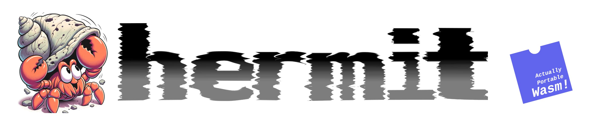

# Hermit

A toolkit for creating Actually Portable WASM Executables, called hermits. See
[blogpost](https://dylibso.com/blog/hermit-actually-portable-wasm).

## Download

See [releases](https://github.com/dylibso/hermit/releases).

## Usage

`./hermit.com [-f <path_to_Hermitfile>] [-o <output_path>]`

If a path to a `Hermitfile` is not provided, it tries to load `Hermitfile` from
the current directory. If an `output_path` is not provided, the hermit is
written to `wasm.com` in the current directory. On Unix-like operating systems
you must `chmod +x wasm.com` to make it executable. This is required because
WASI does not have a `chmod` function.

> Note: you may need to call `hermit.com` and its resulting hermits using `sh`
> as such:

```sh
sh ./hermit.com
```

On ARM / Apple Silicon:

```sh
arch -x86_64 ./uuid.com  

# or, possibly needed to run with `sh`:
arch -x86_64 sh ./uuid.com
```

### On the `.com` extension...

Hermit takes advantage of the
[Cosmopoliltan Libc](https://github.com/jart/cosmopolitan) and produces
multi-platform X86_64 binary executables (called
[αcτµαlly pδrταblε εxεcµταblε](https://justine.lol/ape.html), or "APE"s for
short). While Unix-like systems do not care about the extension, certain Windows
environments require that an extension is used. Remove it if you'd like, but it
must be present for the same executable to be run on Windows.

## Hermitfile syntax

### Supported:

- `FROM <path_to_wasm_without_quotes>` - mandatory, instructs the hermit CLI
  what Wasm module to use. Path can be relative to the location of the
  `Hermitfile`.
- `MAP <[paths]>` - maps an array of directories (and their subdirectories) into
  the WASI filesystem used by the Wasm module.You cannot map the `.` and `/` at
  the same time, see `ENV_PWD_IS_HOST_CWD`.
- `ENV KEY=VALUE` - declares an environment variable for the Wasm. Can be used
  multiple times or provided multiple K=V pairs on a single line separated by a
  whitespace.
- `ENV_PWD_IS_HOST_CWD` - passes the current working directory on the host into
  the Wasm via the environment variable `$PWD`. This works around a limitation
  in WASI that there's no way to initialize the current working directory when
  combined with adding `chdir(getenv("PWD"))` or equivalent into the beginning
  of your Wasm program.
- `ENV_EXE_NAME_IS_HOST_EXE_NAME` - passes the path to the currently running
  executable into the Wasm via the environment variable `EXE_NAME`. This was
  implemented to enable implementing the hermit CLI as a hermit.

### Unimplemented:

- `NET <[hostnames]>` - takes an array of hostnames used to configure an
  allowlist of outbound connections.

- `LINK <[wasm]>` - takes a list of Wasm module locations (file paths, URLs,
  etc) to link with the main Wasm module defined in `FROM`.

## Limitations

- Currently only uses WAMR's interpreter mode.
  - Wasm runs slow
  - Wasm with SIMD is unsupported
- In order for the Wasm to inherit the current directory from the host, it must
  set it itself, possibly using `ENV_PWD_IS_HOST_CWD` and loading from `$PWD`.
- Network isn't implemented yet. WAMR has support so it probably isn't a hard
  change.
- External functionality is limited to what WASI supports.
- Only x86_64 supported right now, but it probably could be extended to use
  `fatcosmocc` instead of `cosmocc`.

## Building

### Setup

1. Clone with submodules so you get WAMR and the forked dockerfile-parser-rs
   (the hermitfile parser)

   `git clone --recurse-submodules git@github.com:dylibso/hermit.git`

2. Bootstrap pest (dockerfile-parser-rs dependency):

   `cd dockerfile-parser-rs/third-party/pest && cargo build --package pest_bootstrap`

3. Clone the Cosmopolitan libc and setup `cosmocc` as mentioned in
   [Getting Started](https://github.com/jart/cosmopolitan/#getting-started). If
   `cosmocc` isn't in your `PATH` after adding a new shell, maybe append to
   `.bashrc` instead.

### Build

`./build_hermit.sh` configures and builds with cmake to the `build` dir.

### Demo hermits

After building, try out:

`./build/cowsay.hermit.com 'Hello, Dylibso!'`

or

`echo aeiou | ./build/count_vowels.hermit.com`

## Community

Hermit shares the [Extism Discord](https://discord.gg/cx3usBCWnc). Join `#hermit` to discuss working with or building Hermit.
